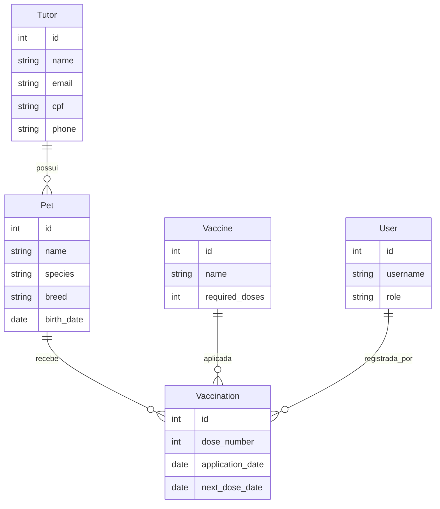

🐾 **Pet Vaccination API - Backend**

📋 **Sobre o Projeto**

O Pet Vaccination API é uma solução robusta desenvolvida para o gerenciamento do histórico vacinal de animais em clínicas veterinárias. O sistema permite o controle centralizado de Pets, Tutores, catálogo de Vacinas e o registro rigoroso de aplicações, garantindo a integridade clínica através de regras de negócio avançadas.

Este projeto foi construído com foco em Clean Code, S.O.L.I.D. e Arquitetura Escalável, atendendo aos requisitos técnicos do desafio IVORE.

🚀 **Tecnologias Utilizadas**

**Core**

* Python 3.12 - Linguagem de programação de alto desempenho.
* Django 6.0.2 - Framework web principal.
* Django Rest Framework (DRF) - Toolkit para construção de APIs RESTful.

**Banco de Dados & Persistência**

* SQLite - Banco de dados relacional padrão (portabilidade).
* dj-database-url - Configuração dinâmica para suporte a PostgreSQL/MySQL.
* Django Migrations - Controle de versão e evolução do esquema de dados.

**Segurança & Autenticação**

* SimpleJWT - Autenticação baseada em tokens JWT.
* RBAC (Role-Based Access Control) - Permissões granulares para Admin, Veterinário e Staff.

**Performance & Resiliência**

* Redis 7 - Cache distribuído e gerenciamento de estado.
* DRF Throttling - Implementação de Rate Limiting para proteção contra abuso.

**Documentação & Monitoramento**

* drf-spectacular - Documentação automática sob o padrão OpenAPI 3.0.
* Django Logging - Sistema de logging estruturado para rastreabilidade.

**Infraestrutura**

* Docker & Docker Compose - Containerização completa do ambiente.
* python-decouple - Gestão segura de variáveis de ambiente (.env).

🏗️ **Arquitetura e Padrões de Design**

O projeto adota o padrão Package by Feature em conjunto com uma Service Layer, promovendo a separação clara de responsabilidades.

**Estrutura de Diretórios**

```text
apps/
├── pets/           # Gestão de Animais
├── tutors/         # Gestão de Responsáveis
├── users/          # Autenticação e Perfis (RBAC)
├── vaccines/       # Catálogo de Imunizantes
└── vaccinations/   # Inteligência de Aplicação
    ├── models.py       # Definição de Dados
    ├── services.py     # Camada de Negócio (Onde reside o S do SOLID)
    ├── serializers.py  # Transformação de Dados
    └── views.py        # Orquestração da API
```

**Princípios de Engenharia Aplicados**

* Single Responsibility Principle (SRP): Toda a lógica complexa de validação de doses foi extraída dos Serializers para a camada de Services.
* DRY (Don't Repeat Yourself): Normalização de dados (CPF, Email) centralizada.
* RESTful Maturity: Uso correto de métodos HTTP e códigos de status semânticos (201 Created, 204 No Content, 405 Method Not Allowed).
___

**Diagrama de Entidade e Relacionamento**

**Destaques da Modelagem**

* Entidade Vaccination: Atua como uma entidade de domínio rica, vinculando o Pet ao Imunizante e ao Veterinário responsável.
* Integridade de Doses: Validação lógica que impede o registro de doses fora de sequência (ex: Dose 2 antes da Dose 1).
* Consistência Cronológica: Bloqueio de registros com datas de aplicação inconsistentes em relação ao histórico do animal.

📦 **Funcionalidades Principais**

✅ Gestão de Pets & Tutores: Cadastro com validação de CPF e normalização de dados.
✅ Catálogo de Vacinas: Configuração de doses requeridas por imunizante.
✅ Registro de Vacinação Inteligente: Validação automática de sequência e datas.
✅ Segurança Baseada em Papéis: Diferenciação de permissões entre Staff e Veterinários.
✅ Rate Limiting: Proteção contra ataques de força bruta ou excesso de requisições.
✅ Documentação Interativa: Swagger UI para testes rápidos de endpoints.

🔗 **Links e Acesso**

Após iniciar os containers, as seguintes interfaces estarão disponíveis:

* Swagger UI (OpenAPI 3): http://localhost:8000/api/docs/
* API Base: http://localhost:8000/api/
* Django Admin: http://localhost:8000/admin/

🚀 **Como Executar o Projeto (Quick Start)**

Graças ao Docker, você não precisa instalar Python ou Django localmente. Todas as dependências são gerenciais automaticamente pelo container.

1. **Pré-requisitos**

Docker e Docker Compose instalados e em execução.

2. **Preparação do Ambiente**

# **Clone o repositório**
git clone [https://github.com/gusteborges/pet-vaccination-api.git](https://github.com/gusteborges/pet-vaccination-api.git)
cd pet-vaccination-api

# **Crie o arquivo de ambiente a partir do exemplo**
cp .env.example .env


3. **Configuração da SECRET_KEY**

O Django exige uma chave secreta exclusiva. Se você tiver Python instalado localmente com a biblioteca Django, pode gerar uma nova chave:

python -c 'from django.core.management.utils import get_random_secret_key; print(get_random_secret_key())'


Caso não possua Django localmente, você pode usar a chave provisória contida no .env.example ou gerar uma string aleatória de 50 caracteres manualmente.

Nota Importante: Se a chave gerada contiver o caractere $, você deve utilizar $$ no arquivo .env para evitar erros de interpretação do Docker Compose.

4. **Build e Inicialização**

# Suba todos os serviços (API, Banco de Dados, Redis)
docker compose up --build


Este comando automatiza a instalação das dependências, executa as migrações e inicia o servidor.

🧪 **Suíte de Testes Automatizados**

Garantimos a qualidade do código através de testes de integração:

docker-compose exec web python manage.py test


👥 **Autor**

Augusto Machado Borges

* Responsável Técnico: @gusteborges
* LinkedIn: [Augusto Borges](https://www.linkedin.com/in/augusto-machado-borges/)

Projeto desenvolvido para o desafio técnico IVORE - 2026.
